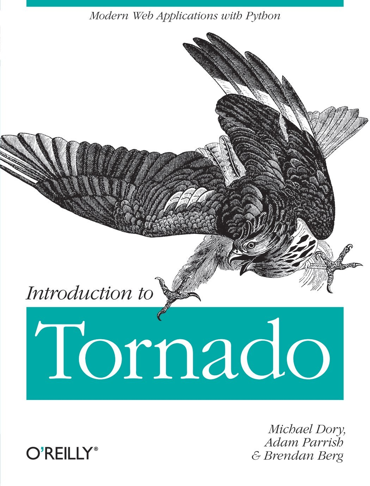

> 参考 http://demo.pythoner.com/itt2zh/index.html

> 文章有所改动，有参杂个人理解。

在过去的五年里，Web开发人员的可用工具实现了跨越式地增长。当技术专家不断推动极限，使Web应用无处不在时，我们也不得不升级我们的工具、创建框架以保证构建更好的应用。我们希望能够使用新的工具，方便我们写出更加整洁、可维护的代码，使部署到世界各地的用户时拥有高效的可扩展性。

这就让我们谈论到Tornado，一个编写易创建、扩展和部署的强力Web应用的梦幻选择。我们三个都因为Tornado的速度、简单和可扩展性而深深地爱上了它，在一些个人项目中尝试之后，我们将其运用到日常工作中。我们已经看到，Tornado在很多大型或小型的项目中提升了开发者的速度（和乐趣！），同时，其鲁棒性和轻量级也给开发者一次又一次留下了深刻的印象。

本书的目的是对Tornado Web服务器进行一个概述，通过框架基础、一些示例应用和真实世界使用的最佳实践来引导读者。我们将使用示例来详细讲解Tornado如何工作，你可以用它做什么，以及在构建自己第一个应用时要避免什么。

在本书中，我们假定你对Python已经有了粗略的了解，知道Web服务如何运作，对数据库有一定的熟悉。有一些不错的书籍可以为你深入了解这些提供参考（比如Learning Python，Restful Web Service和MongoDB: The Definitive Guide）。

你可以在[Github](https://github.com/Introduction-to-Tornado)上获得本书中示例的代码。如果你有关于这些示例或其他方面的任何思想，欢迎在那里告诉我们。

所以，事不宜迟，让我们开始深入了解吧！

### 目 录
### [第一章：引言](https://github.com/tangjiaxing669/Tornado/blob/master/%E5%BC%95%E8%A8%80.md)
### [第二章：表单和模板](https://github.com/tangjiaxing669/Tornado/blob/master/%E8%A1%A8%E5%8D%95%E5%92%8C%E6%A8%A1%E6%9D%BF.md)
### [第三章：模板扩展](https://github.com/tangjiaxing669/Tornado/blob/master/%E6%A8%A1%E6%9D%BF%E6%89%A9%E5%B1%95.md)
### [第四章：数据库](https://github.com/tangjiaxing669/Tornado/blob/master/%E6%95%B0%E6%8D%AE%E5%BA%93.md)
### [第五章：异步Web服务](https://github.com/tangjiaxing669/Tornado/blob/master/%E5%BC%82%E6%AD%A5Web%E6%9C%8D%E5%8A%A1.md)
### [第六章：编写安全应用](https://github.com/tangjiaxing669/Tornado/blob/master/%E7%BC%96%E5%86%99%E5%AE%89%E5%85%A8%E5%BA%94%E7%94%A8.md)
### [第七章：外部服务认证](https://github.com/tangjiaxing669/Tornado/blob/master/%E5%A4%96%E9%83%A8%E6%9C%8D%E5%8A%A1%E8%AE%A4%E8%AF%81.md)
### [第八章：部署Tornado](https://github.com/tangjiaxing669/Tornado/blob/master/%E9%83%A8%E7%BD%B2Tornado.md)
