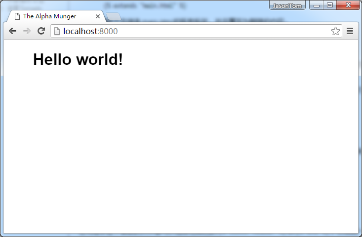
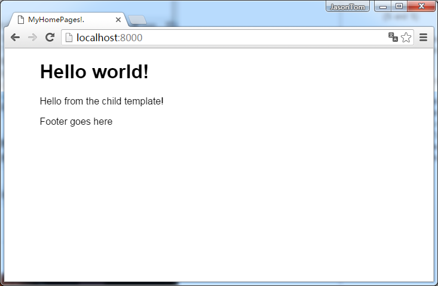
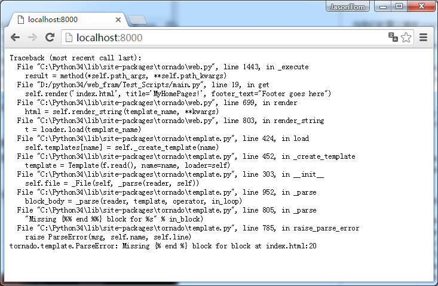

### 模板扩展

在[第二章](https://github.com/tangjiaxing669/Tornado/blob/master/%E8%A1%A8%E5%8D%95%E5%92%8C%E6%A8%A1%E6%9D%BF.md)中，我们看到了Tornado模板系统如何简单地传递信息给网页，使你在插入动态数据时保持网页标记的整洁。然而，大多数站点希望复用像header、footer和布局网格这样的内容。在这一章中，我们将看到如何使用扩展Tornado模板或UI模块完成这一工作。

### 块和替换

当你花时间为你的Web应用建立和制定模板时，希望像你的后端Python代码一样重用你的前端代码这似乎只是合逻辑的，不是吗？幸运的是，Tornado可以让你做到这一点。tornado通过`extends`和`block`语句支持模板继承，这就让你拥有了编写能够在合适的地方复用流体模板的控制权和灵活性。

为了扩展一个已经存在的模板，你只需要在新的模板文件的顶部放上一句``。比如，为了在新模板中扩展一个父模板（在这里假设为main.html），你可以这样使用：

```python

```

这就使得新文件继承main.html的所有标签，并且覆写为期望的内容。

### 块基础

扩展一个模板使你复用之前写过的代码更加简单，但是这并不会为你提供所有的东西，除非你可以适应并改变那些之前的模板。所以，`block`语句出现了。

一个块语句压缩了一些当你扩展时可能想要改变的模板元素。比如，为了使用一个能够根据不同页覆写的动态`header`块，你可以在父模板main.html中添加如下代码：

```html
<header>
    
</header>
```

然后，为了在子模板index.html中覆写``部分，你可以使用块的名字引用，并把任何你想要的内容放到其中。

```html



    <h1>Hello World!</h1>

```

任何继承这个模板的文件都可以包含它自己的``和``部分，然后把一些不同的东西加进去。

为了在web应用中调用这个子模板，你可以在你的python脚本中很轻松的渲染它，就像之前你渲染其他模板那样：

```python
class MainHandler(RequestHandler):
    def get(self):
        self.render("index.html")
```

所以此时，main.html中的`body`块在加载时会被以index.html中的信息“Hello World！”填充。



我们已经可以看到这种方法在处理整体页面结构和节约多页面网站的开发时间上多么有用。更好的是，你可以为每个页面使用多个块，此时像header和footer这样的动态元素将会被包含在同一个流程中。

下面是一个在父模板main.html中使用多个块的例子：

```html
<!DOCTYPE html>
<html>
    <header>
        
    </header>
    <head>
        <meta charset="UTF-8">
        <link rel="stylesheet" href="{{ static_url("style.css") }}">
        <title>
            
        </title>
    </head>
    <content>
        
    </content>
    <footer>
        
    </footer>
    <body>
    </body>
</html>
```

当我们扩展父模板main.html时，可以在子模板index.html中引用这些块。

```html
<!DOCTYPE html>
<html>
    
    
        <h1>Hello world!</h1>
    
    <head>
        <meta charset="UTF-8">
        <link rel="stylesheet" href="{{ static_url("style.css") }}">
        
            {{ title }}.
        
    </head>
    <body>
        
            <p>Hello from the child template!</p>
        

        
            <p>{{ footer_text }}</p>
        
    </body>
</html>
```

用来加载模板的python脚本和上一个例子差不多，不过在这里我们传递了几个字符串变量给模板使用；

```python
class IndexHandler(RequestHandler):
    def get(self, *args, **kwargs):
        self.render('index.html', title='MyHomePages!', footer_text="Footer goes here")
```



你也可以保留父模板块语句中的默认文本和标记，就像扩展模板没有指定它自己的块版本一样被渲染。这种情况下，你可以根据某页的情况值替换必须的东西，这在包含或替换脚本、CSS文件和标记块时非常有用。

> 注意，正如模板文件所记录的；一个语法错误或者没有闭合的``语句可以使得浏览器直接显示500：Internal Server Error（如果你运行在`debug`模式下会引发完整的Python堆栈跟踪）；如下。总之，为了你自己好的的话，你需要使自己的模板尽可能的鲁棒，并且在模板被渲染之前发现错误。


