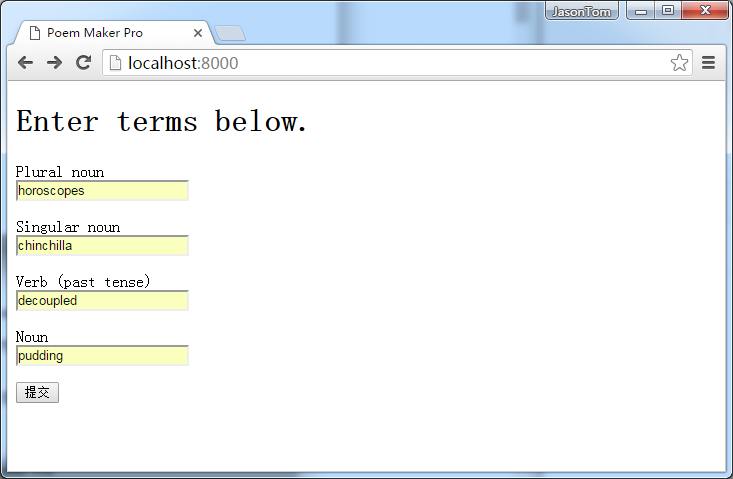

### 表单和模板

在[第一章](https://github.com/tangjiaxing669/Tornado/blob/master/%E5%BC%95%E8%A8%80.md)中，我们学习了使用Tornado创建一个Web应用的基础知识。包括处理函数、HTTP方法以及Tornado框架的总体结构。在这章中，我们将学习一些你在创建Web应用时经常会用到的更强大的功能。

和大多数Web框架一样，Tornado的一个重要目标就是帮助你更快地编写程序，尽可能整洁地复用更多的代码。尽管Tornado足够灵活，可以使用几乎所有Python支持的模板语言，Tornado自身也提供了一个轻量级、快速并且灵活的模板语言在`tornado.template`模块中。

### 简单示例：Poem Maker Pro

让我们以一个叫做`Poem Maker Pro`的简单例子开始。`Poem Maker Pro`这个web应用有一个让用户填写的HTML表单，然后处理表单的结果。如下(`poemmaker.py`)：

```python
import os.path

import tornado.httpserver
import tornado.ioloop
import tornado.options
import tornado.web

from tornado.options import define, options
define("port", default=8000, help="run on the given port", type=int)
define("address", default="0.0.0.0", help="Server Address.", type=str)

class IndexHandler(tornado.web.RequestHandler):
    def get(self):
        self.render('index.html')

class PoemPageHandler(tornado.web.RequestHandler):
    def post(self):
        noun1 = self.get_argument('noun1')
        noun2 = self.get_argument('noun2')
        verb = self.get_argument('verb')
        noun3 = self.get_argument('noun3')
        self.render('poem.html', roads=noun1, wood=noun2, made=verb,
                difference=noun3)

if __name__ == '__main__':
    tornado.options.parse_command_line()
    app = tornado.web.Application(
        handlers=[(r'/', IndexHandler), (r'/poem', PoemPageHandler)],
        template_path=os.path.join(os.path.dirname(__file__), "templates")
    )
    http_server = tornado.httpserver.HTTPServer(app)
    http_server.listen(port=options.port, address=options.address)
    tornado.ioloop.IOLoop.instance().start()
```

除了`poemmaker.py`，你还需要将如下代码文件加入到你的`templates`子目录中去。

**index.html**:
```html
<!DOCTYPE html>
<html>
    <head>
        <meta charset="UTF-8">
        <title>Poem Maker Pro</title>
    </head>
    <body>
        <h1>Enter terms below.</h1>
        <form method="post" action="/poem">
        <p>Plural noun<br><input type="text" name="noun1"></p>
        <p>Singular noun<br><input type="text" name="noun2"></p>
        <p>Verb (past tense)<br><input type="text" name="verb"></p>
        <p>Noun<br><input type="text" name="noun3"></p>
        <input type="submit">
        </form>
    </body>
</html>
```

**poem.html**:
```html
<!DOCTYPE html>
<html>
    <head>
        <meta charset="UTF-8">
        <title>Poem Maker Pro</title>
    </head>
    <body>
        <h1>Your poem</h1>
        <p>Two {{roads}} diverged in a {{wood}}, and I—<br>
I took the one less travelled by,<br>
And that has {{made}} all the {{difference}}.</p>
    </body>
</html>
```

在命令行执行下述命令：

```shell
$ python poemmaker.py --port=8000
```

现在，在浏览器中打开[http://localhost:8000](http://localhost:8000/)。当浏览器请求根目录（/）时，Tornado程序将渲染index.html，如下：



这个表单包括多个文本域（命名为**noun1**、**noun2**等），其中的内容将在用户点击**提交**按钮时以`POST`请求的方式送到`/poem`。现在往里面填写点东西然后点击提交吧。

为了响应这个`POST`请求，Tornado应用跳转到`poem.html`，插入你在表单中填写的值。结果是Robert Frost的诗《The Road Not Taken》的轻微修改版本。如下图：


